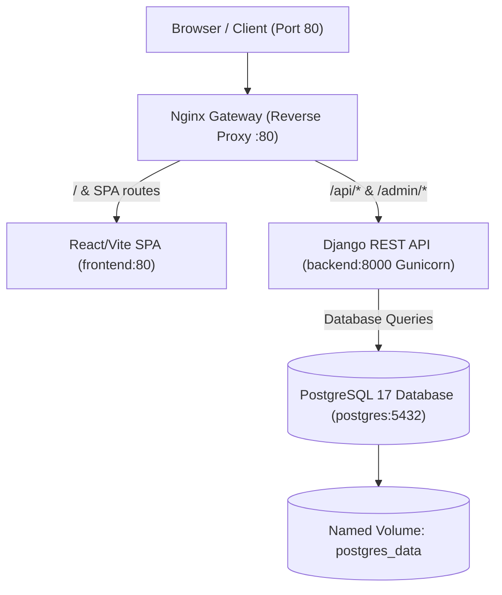

# Ahoum — Live Workshop & Session Booking Marketplace

Ahoum is a production-grade full-stack marketplace application built with **Django REST Framework (DRF)**, **React + Vite + TypeScript**, **PostgreSQL**, and **Nginx**. It provides role-based access for Creators (hosting workshops) and Learners (browsing and booking sessions) with row-locked atomic concurrency protection and GitHub OAuth integration.

---

## Architecture Overview



- **Nginx Reverse Proxy**: Single ingress point on port `80`, handling client-side SPA routing (`try_files $uri $uri/ /index.html;`) and reverse-proxying `/api/` traffic to Django.
- **Frontend (Client)**: React 18, TypeScript, Tailwind CSS v4, and Vite with centralized API clients and JWT authentication state management.
- **Backend (Server)**: Django 5 + Django REST Framework, JWT authentication via SimpleJWT, row-level concurrency locking (`select_for_update()`), and GitHub OAuth.
- **Database**: PostgreSQL 17 with automated migrations and named volume disk persistence.

---

## Project Structure

```text
Ahoum/
├── client/                     # Frontend React + TypeScript application
│   ├── src/                    # Components, pages, context, and API layer
│   │   ├── api/                # Centralized API service methods
│   │   ├── components/         # Reusable UI & role components
│   │   ├── context/            # AuthContext and state providers
│   │   └── pages/              # Application views (Sessions, Bookings, Creator)
│   ├── .env.example            # Frontend environment template
│   ├── default.conf            # Internal Nginx configuration for static assets
│   └── Dockerfile              # Multi-stage Docker build for React application
├── server/                     # Backend Django REST Framework application
│   ├── authentication/         # Auth, JWT token refresh, & GitHub OAuth views
│   ├── accounts/               # Account profile endpoints
│   ├── bookings/               # Booking management with concurrency protection
│   ├── config/                 # Django settings, WSGI, and root routing
│   ├── sessions/               # Workshop session CRUD & attendee roster
│   ├── users/                  # Custom user model with USER & CREATOR roles
│   ├── .env.example            # Backend environment template
│   ├── Dockerfile              # Python slim image with Gunicorn and migrations
│   └── requirements.txt        # Python dependencies
├── nginx/                      # Main reverse proxy gateway
│   ├── Dockerfile              # Reverse proxy container
│   └── nginx.conf              # Reverse proxy routing rules
├── .env.example                # Root environment template
├── docker-compose.yml          # Multi-container orchestration (Postgres, Backend, Frontend, Nginx)
└── README.md                   # Project documentation
```

---

## Prerequisites

- **Docker Desktop** (version 24.0+ with Docker Compose v2)
- *(Optional for local non-Docker development)*:
  - Python 3.11+ / 3.12+
  - Node.js 20+ & npm

---

## Environment Setup

1. **Backend Environment**:
   Copy the sample environment file in `server/`:
   ```bash
   cp server/.env.example server/.env
   ```
   *(Ensure `DB_NAME`, `DB_USER`, `DB_PASSWORD`, `DJANGO_SECRET_KEY`, and optional GitHub OAuth credentials are configured).*

2. **Frontend Environment**:
   Copy the sample environment file in `client/`:
   ```bash
   cp client/.env.example client/.env
   ```

3. **Root Environment (Optional)**:
   For centralized Docker variable overrides, you can also copy `.env.example`:
   ```bash
   cp .env.example .env
   ```

---

## Running the Complete Application with Docker

Start the complete stack with a single command:

```bash
docker compose up --build
```

To run in the background (detached mode):
```bash
docker compose up --build -d
```

### Access the Application
Once the containers are running:
- **Web Application**: [http://localhost](http://localhost)
- **API Endpoints**: [http://localhost/api/](http://localhost/api/)
- **Django Admin**: [http://localhost/admin/](http://localhost/admin/)

---

## PostgreSQL Database Persistence

Database records are persisted using the Docker named volume `postgres_data` mapped to `/var/lib/postgresql/data`.

- **Stopping the application safely**:
  ```bash
  docker compose down
  ```
  *All database tables, users, sessions, and booking records **survive** and remain intact for subsequent launches.*

- **Restarting the application**:
  ```bash
  docker compose restart
  ```
  *Database volume **survives** container restart.*

- **Resetting the database (Destructive)**:
  ```bash
  docker compose down -v
  ```
  *The `-v` (or `--volumes`) flag explicitly purges the database volume and all stored records.*

---

## Local Development (Without Docker)

If developing locally outside Docker containers:

### 1. Start PostgreSQL
```bash
docker compose up postgres -d
```

### 2. Run Backend (Django)
```bash
cd server
python -m venv .venv
source .venv/bin/activate   # On Windows: .venv\Scripts\activate
pip install -r requirements.txt
python manage.py migrate
python manage.py runserver
```

### 3. Run Frontend (Vite)
```bash
cd client
npm install
npm run dev
```

---

## Running Automated Tests & Code Quality Checks

### Backend Test Suite
The backend contains 48 unit and integration tests covering authentication, permissions, sessions, capacity limits, and multithreaded booking concurrency:
```bash
cd server
python manage.py test authentication sessions bookings
```
*(On Windows, you can also use `py manage.py test authentication sessions bookings`)*

### Frontend Linting
```bash
cd client
npm run lint
```

### Frontend Typecheck & Build Validation
```bash
cd client
npm run build
```

---

## Key Features Implemented

1. **Role-Based Workflows**:
   - **Creators**: Create, edit, manage sessions, and view live participant rosters with fill-rate metrics.
   - **Learners (Users)**: Browse active workshop catalog, book seats, view tickets, and cancel reservations.
2. **Atomic Row-Level Concurrency**:
   - Booking uses `select_for_update()` inside atomic transactions to strictly prevent race conditions and overbooking.
3. **Authentication & Token Lifecycle**:
   - Email/password registration & login with role selection.
   - GitHub OAuth with cancellation handling and interactive onboarding role selection.
   - Transparent JWT access token refresh with interceptors in `client.js`.
4. **Single-Origin Deployment**:
   - Zero CORS complications in production thanks to Nginx reverse proxying.
